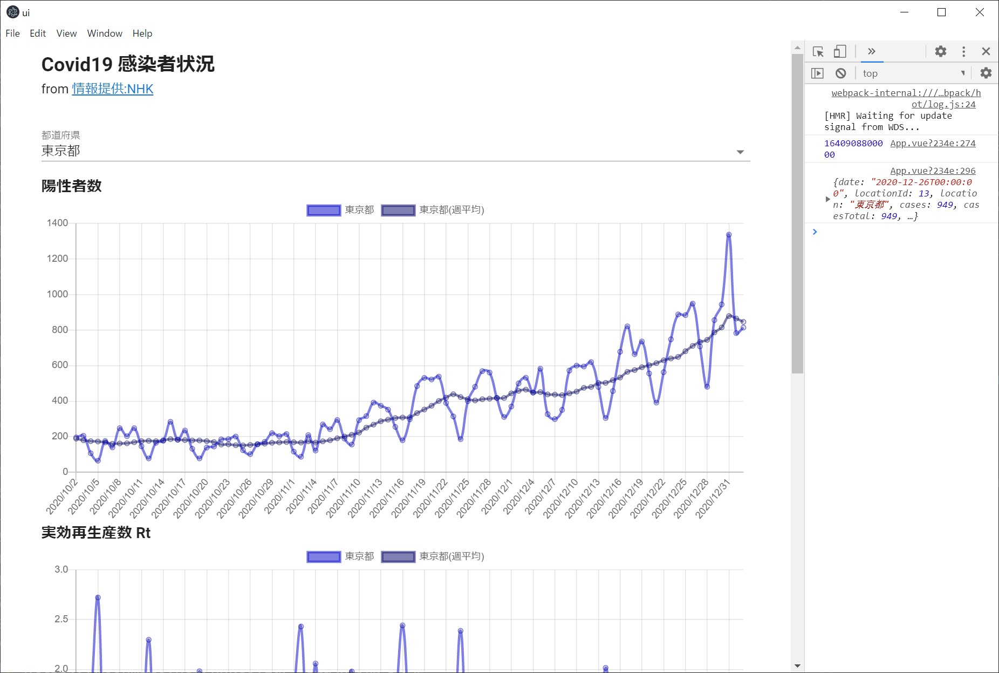

# NHKCovid
Covid 19 の観測サイト

[新型コロナウイルス データで見る感染状況一覧｜NHK特設サイト](https://www3.nhk.or.jp/news/special/coronavirus/data-widget/) より 都道府県ごとの感染者数の推移を取得して、グラフ化するプログラムです。

- 陽性者数
- 実効再生産数 Rt
- Rt による1か月先の陽性者数予測

ができます。

## CrowlFunc

Azure Functins を使い NHK 提供のデータを利用しやすくします。元データが CSV 形式のため、これを JSON 形式に直します。

```json
{
    "result": [
        {
            "date": "2020-01-16T00:00:00",
            "locationId": 1,
            "location": "北海道",
            "cases": 0,
            "casesTotal": 0,
            "deaths": 0,
            "deathsTotal": 0,
            "casesAverage": 0.0,
            "casesRt": 0.0,
            "casesRtAverage": 0.0
        },
        ...
```

https://sample-moonmile.azurewebsites.net/api/NHKCovid で受信できます。

## ui

vue.js + Chart.js によるグラフ化です。

https://moonmile.net/nhkcovid/ で閲覧可能です。

electron 化しているので、

```
yarn run electron:serve
```

すると、ローカルPC上で動作します。



## Licence

MIT

## Author 

Tomoaki Masuda